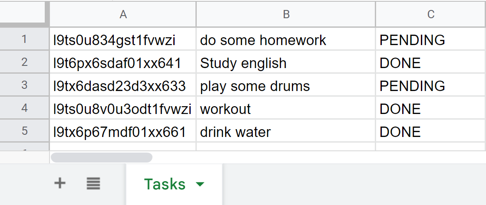

# To-Do

tiny project to make an To Do rest API using Google Spreadsheet and Apps Script

## Database

For the Schema of the spreadsheet, we have the main page named Tasks, and the data with the columns:

| id  | task | status |
| --- | ---- | ------ |

as we can see in the image


## Router

Apps script just provide two main routes to be accessed, doGet and doPost. Consequently we have a hard coded router, where the routes is passed by the param "q"

### Routes

POST {baseurl}?q=insertTask

```typescript
body = {
  task: 'TASK DESCRIPTION',
  status: 'PENDING' | 'DONE' | 'ANOTHER',
};
```

POST {baseurl}?q=getTask

```typescript
// The task can be filtered by the status
body = {
  filter: 'PENDING' | 'DONE' | 'ANOTHER',
};
```

POST {baseurl}?q=modfyTask

```typescript
// You have to provide either task, status, or both to be edited
body = {
  id: 'TASK ID',
  task: 'TASK DESCRIPTION',
  status: 'PENDING' | 'DONE' | 'ANOTHER',
};
```
